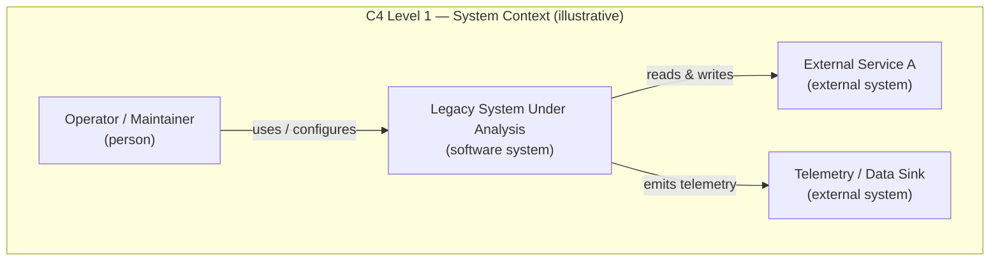
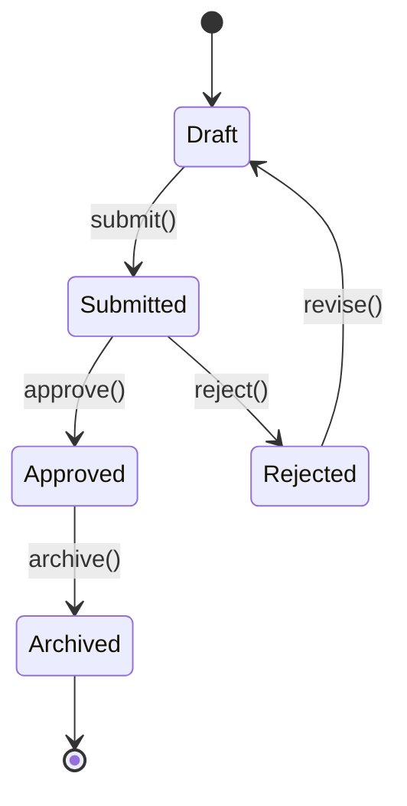
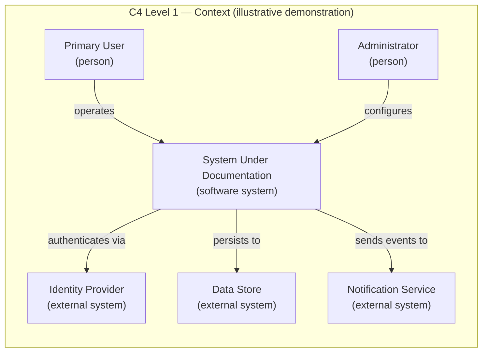
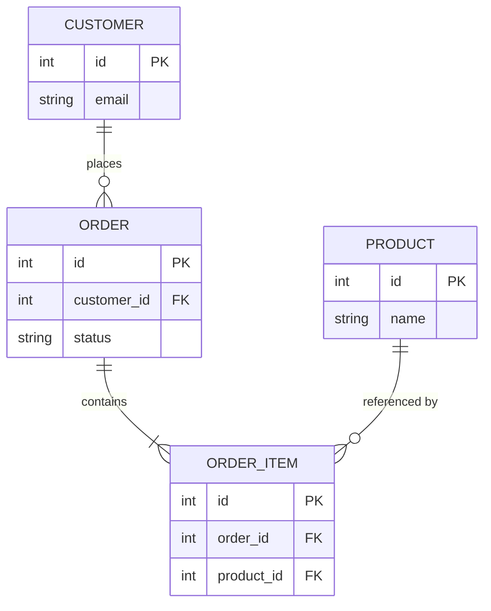

# Blitzy Technical Specification vs. Reversa `_reversa_sdd/`: A Documentation-Artifact Comparison for ArduPilot

> **Audience:** Account Executive (AE) leadership and the account-management team.
> **Purpose:** A rigorous, evidence-cited, dimension-by-dimension comparison of two reverse-engineering **documentation artifacts** produced for the same subject codebase — **ArduPilot** (`github.com/ArduPilot/ardupilot`): (a) the **Blitzy Platform Technical Specification** and (b) the **Reversa `_reversa_sdd/` output tree**.

**Abstract.** This document compares how two competing reverse-documentation approaches describe the *same* legacy system, ArduPilot, and packages the finding for client-facing conversations. It is honest by construction: every comparative claim below resolves to a checkable location — a repository path for the Reversa side, a Technical Specification section for the Blitzy side, or an arXiv identifier for external corroboration — and wherever a capability exists on one side but not the other, the missing side is written explicitly as *"not present in provided inputs"* rather than inferred. A material constraint is stated up front and honored throughout: **the two *rendered* ArduPilot artifacts were not provided as inputs.** The comparison therefore proceeds at the **methodology / capability level**, grounded in Reversa's own product source (a faithful proxy for what Reversa *produces*) and in a genuine Blitzy Technical Specification (a faithful proxy for what Blitzy *produces*). Every point that would require ArduPilot line-level evidence is deferred to **Appendix B — Gap Register** and marked 🔴, never fabricated. The analysis finds that Reversa leads on traceability granularity, implicit-knowledge extraction, gap transparency, and machine-oriented reusability; that the two are near-parity on architectural visualization; and that Blitzy leads on runtime/dynamic validation breadth and single-artifact executive readability — with a real, evidenced balancing point recorded for **every** dimension.

---

## Table of Contents

- [Part 0 — Provenance & Method Note](#part-0--provenance--method-note)
- [Part 1 — Executive Summary (for the Account Executive leader)](#part-1--executive-summary-for-the-account-executive-leader)
- [Part 2 — Dimension-by-Dimension Comparison](#part-2--dimension-by-dimension-comparison)
  - [Dimension 1 — Traceability of claims to source](#dimension-1--traceability-of-claims-to-source)
  - [Dimension 2 — Architectural visualization](#dimension-2--architectural-visualization)
  - [Dimension 3 — Implicit business-knowledge extraction](#dimension-3--implicit-business-knowledge-extraction)
  - [Dimension 4 — Gap transparency](#dimension-4--gap-transparency)
  - [Dimension 5 — Runtime / dynamic validation](#dimension-5--runtime--dynamic-validation)
  - [Dimension 6 — Output granularity and reusability](#dimension-6--output-granularity-and-reusability)
- [Part 3 — Consolidated Balance & Limitations Table](#part-3--consolidated-balance--limitations-table)
- [Part 4 — "Reversa-Manner" Supplementary Documentation](#part-4--reversa-manner-supplementary-documentation)
- [Appendix A — Evidence Citation Index](#appendix-a--evidence-citation-index)
- [Appendix B — Gap Register](#appendix-b--gap-register)

---

## Part 0 — Provenance & Method Note

### 0.1 What is being compared

This document compares **two documentation artifacts about ArduPilot**, not the ArduPilot source code itself:

1. the **Blitzy Platform Technical Specification** for ArduPilot — a single, consolidated specification document; and
2. the **Reversa `_reversa_sdd/` output tree** for ArduPilot — a multi-file specification tree generated by the Reversa framework.

The comparison is confined to these two artifacts for ArduPilot only. It does **not** reverse-engineer ArduPilot, and it does **not** speculate about the roadmap or pricing of either product.

### 0.2 The input gap (stated up front, honored throughout)

The two **rendered** ArduPilot artifacts named above are **not present in the provided inputs.** This was verified exhaustively: there is no Reversa `_reversa_sdd/` ArduPilot tree, no Blitzy ArduPilot Technical Specification document, and **zero** occurrences of the string "ardupilot" anywhere in the materials provided. The repository actually checked out is **Reversa's own product source code** — the framework that *produces* `_reversa_sdd/` trees — not the ArduPilot subject codebase and not either rendered artifact.

Consistent with the no-fabrication rule (§0.4), this absence is treated as a **documented input gap, not a blocker.** The comparison is conducted at the **methodology / capability level**, using authoritative proxies for each side:

| Side | Authoritative proxy used | Why it is a valid proxy |
|------|--------------------------|--------------------------|
| **Reversa** | The in-repository methodology files listed in §0.3 (README, output taxonomy, and the per-agent `SKILL.md` specifications) | These files *define exactly what Reversa produces and how* — the confidence scale, the `_reversa_sdd/` file taxonomy, and each agent's output contract. They are a faithful proxy for the *shape and discipline* of any Reversa ArduPilot output. |
| **Blitzy** | *This* Technical Specification (a genuine Blitzy artifact) | A real Blitzy Technical Specification exemplifies Blitzy's output *format and conventions* — its Requirements Traceability Matrix, architecture sections, and enterprise-breadth sections — and is a faithful proxy for the *shape and discipline* of a Blitzy ArduPilot output. |

Every claim that would require **ArduPilot line-level evidence** (for example, "the ArduPilot ERD has N entities" or "coverage on the actual ArduPilot outputs was X%") is **out of reach from the provided inputs** and is recorded in **Appendix B — Gap Register** as a 🔴 GAP. No such claim is invented.

### 0.3 Citation conventions

Every comparative claim in this document carries a citation resolving to a checkable location:

- **Reversa side → a repository path**, optionally with a section or line reference. Examples: `[agents/reversa-writer/SKILL.md]`, `[README.md:§Confidence scale]`, `[templates/plan.md:L56]`.
- **Blitzy side → a Technical Specification section**, e.g. `[Tech Spec §2.5]`. The Blitzy-side sections referenced in this document are drawn from the set §1.1, §1.3, §2.5, §4.1, §4.8, §5.1, §6.2, §6.4, §6.5, §6.6, §8.6, §9.1.
- **External corroboration → an arXiv identifier or "third-party tutorial"**, e.g. `[arXiv 2605.18684]`, `[arXiv 2606.04967]`, `[third-party tutorial]`.
- **Absent input → the tag 🔴 GAP (input absent)** plus an entry in Appendix B.

The Reversa-side repository sources are authored partly in Portuguese; all quotations from them below are faithful English translations kept deliberately short.

### 0.4 The no-fabrication rule

Three rules govern every sentence that follows:

1. **Every comparative claim cites a checkable location.** If it is not citable, it is not asserted.
2. **One-sided silence is stated explicitly.** Where a capability exists on one side and the other side is silent in the provided inputs, the text reads *"not present in provided inputs"* — never an inference dressed as fact. This mirrors Reversa's own 🔴 GAP convention `[README.md:§Confidence scale]`.
3. **Balance is mandatory.** Each dimension names at least one real, evidenced Blitzy advantage **or** Reversa limitation; no "stronger/better" statement is allowed to stand without a checkable counter-point.

All ArduPilot-specific, line-level assertions are deferred to Appendix B. The body of this document compares **methodologies and capabilities**, which the provided proxies fully support.

---

## Part 1 — Executive Summary (for the Account Executive leader)

### 1.1 Headline verdict

Both artifacts do the same job — turn an undocumented legacy system into a specification a team (or an AI agent) can act on — but they optimize for **different consumers**. **Reversa optimizes the documentation for machines and migration engineers**: it fragments the system into many small, individually addressable files, tags every single claim with a confidence level, and ships an explicit register of what it does not know. **Blitzy optimizes the documentation for people and enterprise delivery**: it consolidates everything into one navigable Technical Specification and pairs the description of the system with the enterprise concerns a delivery organization is judged on — security, monitoring, testing, and CI/CD.

**One-line positioning of each product:**

- **Reversa** — an open-source (MIT) reverse-**documentation** framework that installs inside a legacy project and coordinates a team of AI agents to emit a traceable, confidence-tagged, multi-file specification tree (`_reversa_sdd/`) `[README.md]` `[arXiv 2605.18684]`.
- **Blitzy** — a platform that produces a single, consolidated, enterprise-grade Technical Specification, integrating the system description with a Requirements Traceability Matrix and the security/monitoring/testing/CI-CD breadth needed to actually deliver `[Tech Spec §2.5]` `[Tech Spec §6.4]` `[Tech Spec §6.5]` `[Tech Spec §6.6]` `[Tech Spec §8.6]`.

The honest, one-sentence takeaway for an account conversation: **Reversa's documentation is more granular, more self-aware about its own uncertainty, and more reusable piece-by-piece; Blitzy's documentation is more readable as a single executive artifact and broader in enterprise-delivery coverage — and each of those strengths comes with a real, checkable caveat.**

### 1.2 Per-dimension headline table

| # | Dimension | Who leads | One-line reason | Balancing caveat |
|---|-----------|-----------|-----------------|------------------|
| 1 | Traceability of claims to source | **Reversa** | Per-claim 🟢/🟡/🔴 tags + a `code-spec-matrix.md` mapping every file to its spec `[agents/reversa-writer/SKILL.md]` | Blitzy's Requirements Traceability Matrix links requirement→design→implementation coherently in one place `[Tech Spec §2.5]`; Reversa's per-claim tags are only as reliable as the host agent applying them `[README.md]` |
| 2 | Architectural visualization | **Near-parity** | Reversa formalizes the C4 triad + full ERD explicitly `[agents/reversa-architect/SKILL.md]` | Blitzy pairs architecture with workflow, state-transition, and DB-design diagrams in one consolidated doc — broader diagram coverage per artifact `[Tech Spec §5.1]` `[Tech Spec §4.1]` `[Tech Spec §4.8]` `[Tech Spec §6.2]` |
| 3 | Implicit business-knowledge extraction | **Reversa** | Dedicated retroactive ADRs (via Git archaeology), `state-machines.md`, `permissions.md` `[agents/reversa-detective/SKILL.md]` | Reversa itself warns this content is largely 🟡 INFERRED — inference is not fact `[agents/reversa-detective/SKILL.md]` |
| 4 | Gap transparency | **Reversa** | Severity-tiered `gaps.md` + `questions.md` + `confidence-report.md` `[agents/reversa-reviewer/SKILL.md]` | An independent taxonomy rates Reversa as **only partial validation** — labeling a gap is not resolving it `[arXiv 2606.04967]` |
| 5 | Runtime / dynamic validation | **Blitzy** | Blitzy ships a Testing Strategy `[Tech Spec §6.6]`; Reversa's "Tracer" is referenced but unimplemented and it emits parity **specs, not executable tests** `[templates/plan.md:L56]` `[agents/reversa-inspector/SKILL.md]` | Reversa's Gherkin parity specs are a genuine, reusable head-start for a migration team even without live execution `[agents/reversa-inspector/SKILL.md]` |
| 6 | Output granularity & reusability | **Split** | Reversa's ~15+ files + folder-per-unit favor selective machine reuse `[README.md:§What is generated]` | One consolidated document is easier to review, version, and hand to an executive — many files raise navigation/drift overhead `[Tech Spec §1.1]` |

### 1.3 Account-management talking points

**Where Reversa's documentation is genuinely stronger — and why it resonates with technical buyers:**

- **Traceability granularity.** Reversa marks *every statement* in a spec with a confidence level and maintains a file-by-file `code-spec-matrix.md` that flags any legacy file lacking a spec as `n/a` `[agents/reversa-writer/SKILL.md]`. For a customer whose primary anxiety is "can I trust this, and what is *not* covered?", this per-claim, per-file granularity is a strong, demonstrable answer.
- **Gap transparency.** Reversa produces a dedicated `gaps.md` (categorized by severity at the deepest documentation level), a `questions.md` human-validation queue, and a `confidence-report.md` that counts 🟢/🟡/🔴 marks and reports an overall confidence percentage `[agents/reversa-reviewer/SKILL.md]`. This is a differentiator worth naming explicitly, because most documentation tools present only what they *know*, never a structured ledger of what they *don't*.
- **Artifact reusability.** The `_reversa_sdd/` tree is ~15+ discrete files plus folder-per-unit specs, tiered by documentation level `[README.md:§What is generated]` `[docs/saidas/index.md]`. A migration team can pick up exactly the `state-machines.md` or one unit's `contracts.md` it needs, without wading through a 200-page document.

**Where Blitzy is stronger or on par — and why it resonates with buyers and executives:**

- **Single-artifact readability.** Blitzy delivers one consolidated Technical Specification. For an executive review, a procurement package, or a hand-off to a delivery lead, "one document, versioned once, read top to bottom" is a genuine usability advantage over a 15-folder tree `[Tech Spec §1.1]`.
- **Enterprise breadth.** Blitzy's specification carries dedicated Security `[Tech Spec §6.4]`, Monitoring & Observability `[Tech Spec §6.5]`, Testing Strategy `[Tech Spec §6.6]`, and CI/CD Pipeline `[Tech Spec §8.6]` sections. Reversa's shipped output is a *specification* of the system; it does not, in the provided inputs, produce an equivalent operational/DevOps envelope. For enterprise accounts this breadth is often the deciding factor.
- **Coherent requirements traceability.** Blitzy's Requirements Traceability Matrix ties requirements to design to implementation inside a single navigable structure `[Tech Spec §2.5]`. Reversa's traceability is *finer-grained* but *distributed* across files; Blitzy's is *coarser-grained* but *cohesive*. Which is "better" depends entirely on the consumer — a point worth making explicitly to a client rather than conceding the whole dimension.

**How to hold the line credibly (the balanced pitch).** The strongest account posture is not "we win every dimension"; it is "we understand exactly where each approach is strong and we are honest about the trade-offs." Concede Reversa's genuine strengths in traceability granularity, gap transparency, and reuse. Then anchor Blitzy on readability and enterprise breadth, and note Reversa's own, publicly documented limitations (§1.6). A balanced, evidence-cited posture is far more persuasive to a technical evaluator than an unqualified superiority claim — and it is exactly the posture Reversa's own authors adopt about their framework `[arXiv 2605.18684]`.

### 1.4 Client-facing documentation-improvement guidance (a rubric)

The following six-criterion rubric is a practical tool for account conversations about improving client-facing documentation usability, readability, and detail. For each criterion we name a concrete, **non-speculative** action Blitzy could adopt from Reversa's manner, and — for balance — where Blitzy's current approach already leads.

| Criterion | What "good" looks like | Concrete action Blitzy could adopt from Reversa's manner | Where Blitzy already leads |
|-----------|------------------------|-----------------------------------------------------------|-----------------------------|
| **Traceability** | Every claim points to a source | Add optional **per-claim confidence tags** (🟢/🟡/🔴) inside sections, in Reversa's style `[README.md:§Confidence scale]` | The Requirements Traceability Matrix already links requirement→design→implementation coherently `[Tech Spec §2.5]` |
| **Completeness** | Coverage is measurable, not assumed | Add a **code↔spec coverage matrix** listing files and marking uncovered ones, per Reversa's `code-spec-matrix.md` `[agents/reversa-writer/SKILL.md]` | Enterprise sections (security/monitoring/testing/CI-CD) make delivery-completeness visible `[Tech Spec §6.4]` `[Tech Spec §8.6]` |
| **Accuracy** | Uncertainty is labeled, not hidden | Distinguish **confirmed vs. inferred** statements explicitly, as Reversa does `[README.md:§Confidence scale]` | A single consolidated source reduces the cross-file contradiction risk inherent in a many-file tree |
| **Readability** | An executive can consume it quickly | (Blitzy already leads here) | **Single consolidated executive-readable artifact** — the core Blitzy advantage on this criterion `[Tech Spec §1.1]` |
| **Reusability** | Consumers can extract just what they need | Offer an optional **section-addressable export** so downstream agents can pull one unit, echoing Reversa's folder-per-unit layout `[agents/reversa-writer/SKILL.md]` | The single-document form is trivially versioned and distributed as one file |
| **Maintainability** | Updates don't cause drift | (Blitzy already leads here) | One document has **one source of truth**; a 15-folder tree risks cross-file drift `[README.md:§What is generated]` |

The reciprocal guidance — what Reversa's *manner* could adopt from Blitzy — is a **single consolidated executive view** layered on top of the file tree, so that a non-technical stakeholder is not asked to navigate `_reversa_sdd/`'s ~15+ files and subfolders to form a top-level understanding `[README.md:§What is generated]`.

### 1.5 Reading the six dimensions as one story (usability, readability, detail)

Stepping back from the individual dimensions, the six findings tell one coherent story that an AE can carry into a client conversation. The story is about **who the documentation is *for*.**

**On usability.** Reversa's usability advantage is for a *technical* consumer: a migration engineer or a downstream coding agent that wants to open exactly one artifact — a single unit's `contracts.md`, or the `permissions.md` matrix — and act on it, without reading anything else `[agents/reversa-writer/SKILL.md]` `[README.md:§What is generated]`. Blitzy's usability advantage is for a *decision-making* consumer: an executive, a procurement reviewer, or a delivery lead who wants the whole picture in one pass and a single file to circulate and version `[Tech Spec §1.1]`. Neither is "more usable" in the abstract; each is more usable *for its intended reader*. The account-management recommendation follows directly: match the artifact form to the buyer's role. When the buyer is an engineering organization mid-migration, Reversa's granularity is a feature; when the buyer is an executive sponsor or a mixed committee, Blitzy's single consolidated artifact is the easier sell.

**On readability.** Readability is where Blitzy has the clearest, most defensible edge. A single, coherent Technical Specification with a Requirements Traceability Matrix connecting requirements to design to implementation reads as one narrative `[Tech Spec §2.5]` `[Tech Spec §1.1]`. A 15+-file tree with ten subfolders `[README.md:§What is generated]` requires the reader to assemble the narrative themselves — powerful for a machine, taxing for a human skim. The honest counter-point, which the AE should volunteer rather than hide, is that Reversa's per-claim confidence tags actually *aid* a careful technical reader's trust even as the multi-file layout costs a casual reader's speed `[README.md:§Confidence scale]`. Readability, in other words, is not one axis but two — *skim-readability* (Blitzy leads) and *trust-readability* (Reversa's confidence marks help).

**On detail.** On raw detail, Reversa's methodology is designed to go deeper: folder-per-unit specs, retroactive ADRs, per-entity state machines, and an RBAC/ACL matrix are all discrete, dedicated artifacts `[agents/reversa-detective/SKILL.md]` `[agents/reversa-writer/SKILL.md]`. Blitzy's detail is broad rather than deep-per-artifact: it spans security, monitoring, testing, and CI/CD in one document `[Tech Spec §6.4]` `[Tech Spec §6.5]` `[Tech Spec §6.6]` `[Tech Spec §8.6]`. The credible framing is not "more detail" versus "less detail" but **depth-per-topic (Reversa) versus breadth-of-topics (Blitzy)** — and the buyer's priorities decide which matters more. A team that needs to reimplement one subsystem faithfully values Reversa's depth; an organization standing up an end-to-end delivery pipeline values Blitzy's breadth.

**The synthesized recommendation for client-facing documentation.** The most actionable guidance the account team can give a client is to borrow the best of both manners: keep Blitzy's single-artifact, executive-readable spine, and layer onto it the three cheap, high-signal Reversa habits — per-claim confidence tags, an explicit gap register, and a code↔spec coverage matrix `[README.md:§Confidence scale]` `[agents/reversa-reviewer/SKILL.md]` `[agents/reversa-writer/SKILL.md]`. Those three additions raise trust and completeness without sacrificing the readability that makes a consolidated document easy to consume and circulate.

### 1.6 Honest limitations and the scope of this comparison

Credibility requires stating the boundaries of this analysis and Reversa's own documented limitations:

- **This comparison is methodology/capability-level.** Because the *rendered* ArduPilot artifacts were not provided, no ArduPilot-specific quantitative claim (actual file counts, coverage percentages, diagram counts on the real outputs) is made here; all such points are recorded in Appendix B as 🔴 GAP.
- **Reversa produces no executable code or tests.** Its Inspector agent is explicit that its `.feature` artifacts are *"specs, not executable tests"* `[agents/reversa-inspector/SKILL.md]`.
- **Reversa's validation is only partial.** An independent taxonomy classifies Reversa as strong in context and specification but with only partial validation, via confidence and gap labels `[arXiv 2606.04967]`.
- **Reversa's output quality is bounded by the host AI agent.** Reversa stores and transmits no LLM API keys and delegates all intelligence to the coding agent already present, so the quality ceiling is the host agent's `[README.md]` `[third-party tutorial]`.
- **Reversa is an MIT CLI with no enterprise SLA.** It ships as an open-source npm package with four runtime dependencies and no build/test tooling `[package.json]` — appropriate for its purpose, but not an enterprise-supported platform.
- **Reversa's authors disclaim superiority.** The framework paper positions Reversa as a framework, an evaluation protocol, and a first exploratory evidence point — explicitly **not** a proof of superiority over other approaches `[arXiv 2605.18684]`. Quoting the authors' own restraint is a powerful, honest talking point.

**Bottom line for the AE team:** lead with honesty. Reversa is a credible, well-designed, open framework whose documentation is finer-grained and more self-aware; Blitzy's documentation is more consolidated, more executive-ready, and broader in enterprise delivery coverage. Every one of those statements is cited above and re-cited, with counter-points, in Parts 2 and 3.

---

## Part 2 — Dimension-by-Dimension Comparison

Each subsection below follows the same fixed structure: **(i)** the Reversa mechanism with citation; **(ii)** the Blitzy mechanism with citation (or an explicit *"not present in provided inputs"*); **(iii)** a **Verdict**; and **(iv)** a **Balance point** — a real, evidenced Blitzy advantage or Reversa limitation. All ArduPilot-specific quantitative claims are deferred to Appendix B.

### Dimension 1 — Traceability of claims to source

**Reversa mechanism.** Reversa enforces traceability at two levels. First, a **per-claim confidence scale**: every statement in a spec is tagged **🟢 CONFIRMED** (extracted directly from code, citable with file and line), **🟡 INFERRED** (deduced from patterns, may be wrong), or **🔴 GAP** (not determinable from code, requires human validation) `[README.md:§Confidence scale]`. The Writer agent makes this mandatory — its rule, translated, is *"Mark every statement with 🟢, 🟡 or 🔴. No exceptions."* `[agents/reversa-writer/SKILL.md]`. Second, a **`traceability/code-spec-matrix.md`** maps each legacy file to its corresponding spec unit with a coverage mark (🟢/🟡/n-a); any file without a spec is flagged `n/a`, making omissions visible `[agents/reversa-writer/SKILL.md]` `[docs/saidas/index.md]`. The framework paper corroborates code↔spec traceability as one of its three emphasized mechanisms `[arXiv 2605.18684]`.

**Blitzy mechanism.** Blitzy provides a **Requirements Traceability Matrix (RTM)** that links requirements to design elements to implementation, giving a single, navigable trace through the specification `[Tech Spec §2.5]`.

**Verdict.** **Reversa is stronger on *granularity*.** Reversa traces at the level of the individual *claim* (file + line + confidence) and the individual *file* (coverage matrix), whereas Blitzy's RTM traces at the level of *requirements and sections*. For a consumer who needs to know the provenance and confidence of a single assertion, Reversa's mechanism is finer.

**Balance point (Blitzy advantage + Reversa limitation).** Blitzy's RTM ties requirement→design→implementation together **coherently inside one navigable document** `[Tech Spec §2.5]`, whereas Reversa's traceability, though finer, is distributed across many files and matrices. Moreover, Reversa's per-claim tags are only as reliable as the host AI agent applying them — Reversa delegates all intelligence to the agent already present and stores no keys, so the accuracy of every 🟢/🟡/🔴 mark is bounded by that host `[README.md]` `[third-party tutorial]`.

### Dimension 2 — Architectural visualization

**Reversa mechanism.** The Architect agent produces the **C4 triad** in Mermaid — **Context** (Level 1), **Containers** (Level 2), and **Components** (Level 3) — plus a **full Entity-Relationship Diagram** (all entities and attributes, relationships with cardinalities 1:1 / 1:N / N:M, and primary/foreign keys), an external-integration map, a technical-debt inventory, and a `traceability/spec-impact-matrix.md` capturing "blast radius" `[agents/reversa-architect/SKILL.md]` `[docs/saidas/index.md]`. Diagram depth scales with the configured documentation level. A third-party walkthrough corroborates that Reversa emits C4 diagrams, ERDs, and state machines `[third-party tutorial]`.

The C4 **Context** manner — the single most executive-legible of the three C4 levels — looks like this (illustrative, generic; not ArduPilot data):

**Blitzy mechanism.** Blitzy pairs multiple diagram types inside the single specification: a **High-Level Architecture** description `[Tech Spec §5.1]`, **System Workflows** `[Tech Spec §4.1]`, **State Transition Diagrams** `[Tech Spec §4.8]`, and a **Database Design** section that serves as the ERD-equivalent `[Tech Spec §6.2]`.

**Verdict.** **Near-parity.** Reversa's distinctive contribution is that it **formalizes the C4 taxonomy explicitly** (context/containers/components as named, separate artifacts) `[agents/reversa-architect/SKILL.md]`, which is cleaner for an architecture-literate reader. Blitzy covers the same conceptual ground (architecture, workflow, state, data) without necessarily labeling it "C4."

**Balance point (Blitzy advantage).** Blitzy pairs architecture with **workflow + state-transition + database-design diagrams in a single consolidated document** `[Tech Spec §5.1]` `[Tech Spec §4.1]` `[Tech Spec §4.8]` `[Tech Spec §6.2]` — arguably **broader diagram coverage per artifact**, and easier to consume because the reader never leaves the document to assemble the architectural picture from separate files.

### Dimension 3 — Implicit business-knowledge extraction

**Reversa mechanism.** The Detective agent specializes in the *why* — the knowledge that lives between the lines of the code. It produces **retroactive Architecture Decision Records via Git archaeology** (mining `git log` for decisions, fixes, refactors, and reverts), a **`state-machines.md`** (for each entity with a status field: the allowed values, the permitted transitions and their triggers, and a Mermaid diagram), and a **`permissions.md`** RBAC/ACL matrix (roles, per-role permissions, and access restrictions). A `domain.md` glossary of business rules is always produced. At the deepest documentation level, each ADR includes the established "Alternatives considered" and "Consequences" sections `[agents/reversa-detective/SKILL.md]`. Preservation of implicit rules is corroborated as core to the framework `[arXiv 2605.18684]`.

**Blitzy mechanism.** Blitzy captures implicit knowledge primarily as **assumptions in its Additional Technical Information** section `[Tech Spec §9.1]`, consolidated rather than split into dedicated ADR / state-machine / permission artifacts.

**Verdict.** **Reversa is stronger.** Dedicated, purpose-built artifacts (retroactive ADRs, `state-machines.md`, `permissions.md`) extract and organize implicit business knowledge more thoroughly and more addressably than a consolidated assumptions section `[agents/reversa-detective/SKILL.md]` vs `[Tech Spec §9.1]`.

**Balance point (Reversa limitation).** Reversa's own Detective specification cautions that this material is largely **🟡 INFERRED** — translated, *"be rigorous — much here will be 🟡"* `[agents/reversa-detective/SKILL.md]`. Inferred business knowledge is a hypothesis, not a fact; the very richness of these artifacts carries a higher share of unconfirmed content, which is precisely why Reversa pairs them with the confidence scale and gap register. Blitzy's consolidated assumptions, by contrast, are presented as explicitly *assumed*, reducing the risk that a reader mistakes inference for confirmed fact `[Tech Spec §9.1]`.

### Dimension 4 — Gap transparency

**Reversa mechanism.** The Reviewer agent operates a dedicated gap-transparency machinery: **`questions.md`** (a queue of open 🔴 items requiring human validation), **`gaps.md`** (unresolved gaps; at the deepest documentation level **categorized by severity** — critical / moderate / cosmetic), and a **`confidence-report.md`** that counts the 🟢/🟡/🔴 marks per spec and reports an overall confidence percentage `[agents/reversa-reviewer/SKILL.md]`. An optional cross-review by a second engine can produce a `cross-review-result.md` `[agents/reversa-reviewer/SKILL.md]`. Preservation of gaps for human validation is one of the framework's three emphasized mechanisms `[arXiv 2605.18684]`.

**Blitzy mechanism.** Blitzy expresses "what we don't know" through the **assumptions in its Additional Technical Information** section `[Tech Spec §9.1]`, rather than a separate severity-tiered gap register and validation queue.

**Verdict.** **Reversa is stronger.** An explicit, severity-tiered gap register plus a human-validation queue and a quantified confidence report is a more structured and more actionable treatment of uncertainty than a consolidated assumptions section `[agents/reversa-reviewer/SKILL.md]` vs `[Tech Spec §9.1]`.

**Balance point (Reversa limitation).** Labeling gaps is not the same as resolving them. An independent taxonomy paper classifies Reversa as strong in context and specification but with **only partial validation**, precisely *because* its validation is delivered via confidence and gap labels rather than by closing the gaps `[arXiv 2606.04967]`. A rich gap register documents uncertainty; it does not remove it — the resolution still depends on human validation.

### Dimension 5 — Runtime / dynamic validation

**Reversa mechanism (stated precisely).** Reversa's exploration-plan template lists, under "Independent Agents," a **"Tracer — dynamic analysis (requires an accessible system)"** entry `[templates/plan.md:L56]`. **However, this Tracer is referenced but not implemented:** there is no `agents/reversa-tracer/` agent folder in the product source (verified against the full agent roster). Tracer is therefore **aspirational**, not a shipped capability, and it would be incorrect to claim Reversa performs live runtime tracing today. Reversa's **shipped** runtime/behavioral-validation output is the Inspector agent's **Gherkin parity specifications** — `parity_specs.md` and `parity_tests/*.feature` — which are explicitly **specifications, not executable tests**. The Inspector's rules, translated, are unambiguous: *"the artifacts produced are parity specs, not executable tests,"* and *".feature files are specs, not executable tests. Do not introduce framework calls."* The user's own coding agent later translates them into a real test framework `[agents/reversa-inspector/SKILL.md]`.

**Blitzy mechanism.** Blitzy ships a dedicated **Testing Strategy** section within the specification `[Tech Spec §6.6]`, articulating the testing approach as part of the delivered artifact.

**Verdict.** **Blitzy advantage / Reversa limitation.** On runtime and dynamic validation, Reversa performs **no live runtime validation** and emits **no executable tests** in its shipped output; its dynamic-analysis agent (Tracer) is referenced in a template but unimplemented `[templates/plan.md:L56]` `[agents/reversa-inspector/SKILL.md]`. Blitzy's inclusion of a Testing Strategy section gives its artifact a validation-oriented dimension that Reversa's shipped output does not match. This is stated precisely and without overclaim on either side.

**Balance point (Reversa strength, for fairness).** Even without live execution, Reversa's Gherkin parity specs are a genuine, structured head-start for a migration team: they define behavioral-parity expectations in a standard, human-readable, framework-agnostic form that a coding agent can mechanically translate into executable tests `[agents/reversa-inspector/SKILL.md]`. The limitation is real, but so is the value of the artifact Reversa does ship.

### Dimension 6 — Output granularity and reusability

**Reversa mechanism.** The `_reversa_sdd/` output is a **multi-file tree**: ~15+ discrete top-level files (`inventory.md`, `dependencies.md`, `code-analysis.md`, `data-dictionary.md`, `domain.md`, `state-machines.md`, `permissions.md`, `architecture.md`, `c4-context.md`, `c4-containers.md`, `c4-components.md`, `erd-complete.md`, `confidence-report.md`, `gaps.md`, `questions.md`) plus subfolders (`sdd/`, `openapi/`, `user-stories/`, `adrs/`, `flowcharts/`, `sequences/`, `ui/`, `database/`, `design-system/`, `traceability/`) `[README.md:§What is generated]` `[docs/saidas/index.md]`. The Writer emits **folder-per-unit** specs — each unit gets its own `requirements.md`, `design.md`, and `tasks.md` (plus optional `contracts.md`, `flows.md`, `edge-cases.md`, `decisions.md`, `questions.md`) — and the whole set is tiered by documentation level `[agents/reversa-writer/SKILL.md]`. The guiding principle is that a spec must be detailed enough for an AI agent to reimplement the feature *without access to the original code* `[agents/reversa-writer/SKILL.md]`.

**Blitzy mechanism.** Blitzy delivers a **single consolidated Technical Specification** — the whole system described in one navigable document `[Tech Spec §1.1]` `[Tech Spec §1.3]`.

**Verdict.** **Split by consumer.** Reversa is **stronger for selective machine reuse**: a downstream agent or migration engineer can address exactly one file or one unit `[README.md:§What is generated]` `[agents/reversa-writer/SKILL.md]`. Blitzy is **stronger for human/executive readability and distribution**: one document reads top-to-bottom, versions as a unit, and hands cleanly to a non-technical stakeholder `[Tech Spec §1.1]`.

**Balance point (Reversa limitation + Blitzy advantage).** Many files raise **navigation and maintenance overhead** and introduce the risk of **cross-file drift** (the same fact stated inconsistently in two places as the tree evolves). A single document has a single source of truth, is trivially versioned, and is far easier to review and hand to an executive `[Tech Spec §1.1]`. The granularity that makes Reversa reusable is the same property that makes it heavier to maintain and consume as a whole.

---

## Part 3 — Consolidated Balance & Limitations Table

This table is the balance guarantee: **every "stronger" finding is paired with a checkable counter-point.** The first six rows correspond to the six dimensions; the remaining rows capture cross-cutting balance items that apply across the comparison.

| Dimension / Item | "Stronger" finding | Checkable counter-point (balance) | Citation(s) |
|------------------|--------------------|-----------------------------------|-------------|
| **1. Traceability** | Reversa: per-claim 🟢/🟡/🔴 + file-level `code-spec-matrix.md` (finer granularity) | Blitzy's RTM is coherent in one navigable document; Reversa's per-claim marks are only as reliable as the host agent applying them | `[agents/reversa-writer/SKILL.md]`; `[Tech Spec §2.5]`; `[README.md]` |
| **2. Architectural visualization** | Reversa formalizes the explicit C4 triad + full ERD | Blitzy bundles architecture + workflow + state-transition + DB-design diagrams per artifact — broader coverage in one doc | `[agents/reversa-architect/SKILL.md]`; `[Tech Spec §5.1]` `[Tech Spec §4.1]` `[Tech Spec §4.8]` `[Tech Spec §6.2]` |
| **3. Implicit business-knowledge** | Reversa: dedicated retroactive ADRs + `state-machines.md` + `permissions.md` | Reversa's own spec warns this content is largely 🟡 INFERRED — inference is not fact | `[agents/reversa-detective/SKILL.md]`; `[Tech Spec §9.1]` |
| **4. Gap transparency** | Reversa: severity-tiered `gaps.md` + `questions.md` + `confidence-report.md` | Independent taxonomy rates Reversa **only partial validation** — labeling ≠ resolving | `[agents/reversa-reviewer/SKILL.md]`; `[arXiv 2606.04967]`; `[Tech Spec §9.1]` |
| **5. Runtime / dynamic validation** | **Blitzy**: ships a Testing Strategy section | Reversa's Tracer is referenced but unimplemented; shipped output is parity **specs, not executable tests** (still a reusable head-start) | `[Tech Spec §6.6]`; `[templates/plan.md:L56]`; `[agents/reversa-inspector/SKILL.md]` |
| **6. Output granularity & reusability** | Reversa: ~15+ files + folder-per-unit (selective machine reuse) | Many files raise navigation/maintenance overhead and cross-file drift risk; one document is easier to review/version/hand to an executive | `[README.md:§What is generated]`; `[agents/reversa-writer/SKILL.md]`; `[Tech Spec §1.1]` |
| **Cross-cutting: executable code** | — | **Reversa produces no executable code or tests** — its parity artifacts are specs, not tests | `[agents/reversa-inspector/SKILL.md]` |
| **Cross-cutting: enterprise SLA** | — | **Reversa is an MIT-licensed CLI with no enterprise SLA** — an open npm package with four runtime deps and no build/test tooling | `[README.md]`; `[package.json]` |
| **Cross-cutting: quality ceiling** | — | **Reversa's output quality is bounded by the host AI agent** — it stores/transmits no LLM keys and delegates all intelligence to the agent already present | `[README.md]`; `[third-party tutorial]` |
| **Cross-cutting: authors' own stance** | — | **Reversa's authors disclaim superiority** — the paper positions it as a framework + evaluation protocol + first exploratory evidence point | `[arXiv 2605.18684]` |
| **Cross-cutting: validation maturity** | — | **Only partial validation** per an independent taxonomy — via confidence/gap labels | `[arXiv 2606.04967]` |
| **Cross-cutting: Blitzy enterprise breadth** | **Blitzy**: dedicated Security, Monitoring & Observability, Testing, CI/CD sections | This breadth is delivery-oriented; it is not the same as Reversa's per-claim source traceability, where Reversa leads | `[Tech Spec §6.4]` `[Tech Spec §6.5]` `[Tech Spec §6.6]` `[Tech Spec §8.6]`; `[agents/reversa-writer/SKILL.md]` |

**Reading of the table.** No row asserts an unqualified win. Reversa's genuine strengths (rows 1, 3, 4, 6) each carry a real limitation; Blitzy's genuine strengths (rows 2, 5, and the enterprise-breadth row) each carry a fair acknowledgment of Reversa's compensating value. This is the honest posture the account team should carry into client conversations.

---

## Part 4 — "Reversa-Manner" Supplementary Documentation

This part reproduces, **in Reversa's artifact style**, the documentation types Blitzy under-produces relative to Reversa. Two rules apply throughout:

1. **All content here is a *format demonstration*, not ArduPilot evidence.** The rendered ArduPilot artifacts were not provided (§0.2), so every example below uses **clearly generic, non-ArduPilot illustrative data** or an explicit 🔴 GAP placeholder. Nothing here should be read as a real ArduPilot fact; all such facts are routed to Appendix B.
2. **Each subsection ends with a "Why Blitzy did not measure up" note** grounded in **access-scope / methodology** reasons — chiefly that Reversa installs *inside* the legacy repository with direct read access to the code and Git history, and enforces per-claim confidence discipline, whereas Blitzy's citation operates at the document/section level.

The recurring access-scope driver is worth stating once: Reversa's policy layer restricts all writes to exactly four folders — `.reversa/`, `_reversa_sdd/`, `_reversa_docs/`, `_reversa_forward/` — and injects the rule, translated, *"Never delete, modify, or overwrite pre-existing files of the legacy project"* `[lib/installer/policy.js]` `[README.md:§Guaranteed immutability]`. Because it runs in-place with full **read** access to source and Git history, Reversa can mine provenance (per-claim confidence, code↔spec coverage, Git-archaeology ADRs) that a document-level methodology does not natively surface.

### 4.1 `confidence-report.md`-style confidence summary

*Reversa manner per `[agents/reversa-reviewer/SKILL.md]`.* The Reviewer counts 🟢/🟡/🔴 marks per spec and reports an overall confidence percentage. **Illustrative format demonstration only — not ArduPilot data:**

| Spec unit (illustrative) | 🟢 CONFIRMED | 🟡 INFERRED | 🔴 GAP | Unit confidence |
|--------------------------|:-----------:|:----------:|:------:|:---------------:|
| `unit-auth` *(demo)* | 18 | 6 | 2 | 69% |
| `unit-billing` *(demo)* | 12 | 9 | 4 | 48% |
| `unit-telemetry` *(demo)* | 20 | 3 | 1 | 83% |
| **Overall (demo)** | **50** | **18** | **7** | **67%** |

> 🔴 **GAP (input absent):** the *real* per-unit confidence counts for the ArduPilot outputs cannot be produced — the rendered `_reversa_sdd/` tree was not provided (see Appendix B).

**Why Blitzy did not measure up.** A per-claim confidence tally requires that *every claim* first carry a confidence tag; Reversa enforces this at authoring time via the Writer's mandatory tagging rule `[agents/reversa-writer/SKILL.md]`, which is a *methodology* choice available to it because it reads the code directly and marks each statement's provenance. Blitzy's specification uses document/section-level citation `[Tech Spec §2.5]` rather than per-claim confidence marks, so a `confidence-report.md`-style tally has no per-claim substrate to aggregate. This is a methodology gap, not a capability failure — and §1.4 lists adopting optional per-claim tags as a concrete improvement.

### 4.2 `code-spec-matrix.md`-style traceability matrix

*Reversa manner per `[agents/reversa-writer/SKILL.md]`.* Each legacy file is mapped to its corresponding spec unit with a coverage mark; a file with no spec is flagged `n/a`. **Illustrative format demonstration only — not ArduPilot data:**

| Legacy file (illustrative) | Corresponding unit | Coverage |
|----------------------------|--------------------|:--------:|
| `src/auth/login.ext` *(demo)* | `unit-auth` | 🟢 |
| `src/billing/invoice.ext` *(demo)* | `unit-billing` | 🟡 |
| `src/legacy/orphan_helper.ext` *(demo)* | — | n/a |
| `src/telemetry/stream.ext` *(demo)* | `unit-telemetry` | 🟢 |

> 🔴 **GAP (input absent):** the *real* ArduPilot file→unit coverage matrix cannot be produced — the ArduPilot source and its rendered `_reversa_sdd/` tree were not provided (see Appendix B).

**Why Blitzy did not measure up.** Building a file-by-file coverage matrix requires enumerating the *legacy files themselves* and checking each against a spec unit — an operation that presumes in-repository read access to the whole file set, which is exactly Reversa's operating model `[lib/installer/policy.js]`. Blitzy's RTM traces requirements→design→implementation `[Tech Spec §2.5]` but does not, in the provided inputs, publish a file-level coverage ledger that flags un-specified files as `n/a`. §1.4 lists adopting a code↔spec coverage matrix as a concrete improvement.

### 4.3 Retroactive Architecture Decision Record (Context / Decision / Alternatives / Consequences)

*Reversa manner per `[agents/reversa-detective/SKILL.md]`* — at the deepest documentation level each ADR carries "Alternatives considered" and "Consequences." **Illustrative format demonstration only — not an ArduPilot decision:**

> **ADR-000X (illustrative): Adopt an append-only event log for state changes**
>
> - **Status:** Accepted *(reconstructed retroactively from Git history — demo)*
> - **Context.** *(demo)* Frequent production incidents were traced to lost intermediate state updates; commit history shows repeated hot-fixes around a mutable status column, followed by a large refactor commit introducing an event table. Confidence: 🟡 INFERRED (reconstructed from `git log` patterns, not from an explicit decision document).
> - **Decision.** *(demo)* Record every state change as an immutable event; derive current state by folding the event stream.
> - **Alternatives considered.** *(demo)* (a) Keep the mutable status column and add row-level locking; (b) add audit triggers to the existing table; (c) adopt the append-only event log. Option (c) was chosen for auditability and replay.
> - **Consequences.** *(demo)* Positive: full audit trail, deterministic replay. Negative: read-time fold cost; requires snapshotting for performance.

> 🔴 **GAP (input absent):** the *real* ArduPilot retroactive ADRs cannot be produced — ArduPilot's Git history was not provided (see Appendix B).

**Why Blitzy did not measure up.** Retroactive ADRs are reconstructed by **Git archaeology** — mining `git log` for decisions, fixes, refactors, and reverts `[agents/reversa-detective/SKILL.md]`. This requires read access to the legacy repository's *version-control history*, which is native to Reversa's in-repo installation model `[lib/installer/policy.js]`. Blitzy consolidates comparable reasoning as assumptions `[Tech Spec §9.1]` rather than as Git-derived ADRs. The difference is one of access scope and method — history-mining versus assumption-capture — not a claim that either is universally superior.

### 4.4 `state-machines.md`-style state diagram

*Reversa manner per `[agents/reversa-detective/SKILL.md]`* — for each entity with a status field: the allowed values, permitted transitions and their triggers, and a Mermaid diagram. **Illustrative format demonstration only — not an ArduPilot entity:**

> Transitions & triggers (illustrative): `Draft→Submitted` on `submit()`; `Submitted→Approved` on `approve()`; `Submitted→Rejected` on `reject()`; `Rejected→Draft` on `revise()`; `Approved→Archived` on `archive()`.
>
> 🔴 **GAP (input absent):** the *real* ArduPilot entity state machines cannot be produced — ArduPilot's status fields and transition logic were not provided (see Appendix B).

**Why Blitzy did not measure up.** Reversa derives state machines by inspecting entities' status fields and the code paths that mutate them `[agents/reversa-detective/SKILL.md]` — again an in-repository, code-reading operation. Blitzy does provide State Transition Diagrams `[Tech Spec §4.8]`, so this is the dimension where the gap is *narrowest*: the difference is that Reversa emits a dedicated per-entity `state-machines.md` artifact, while Blitzy embeds state transitions within the consolidated specification.

### 4.5 `permissions.md`-style RBAC/ACL matrix

*Reversa manner per `[agents/reversa-detective/SKILL.md]`* — roles, per-role permissions, and access restrictions in a matrix. **Illustrative format demonstration only — not ArduPilot roles:**

| Role (illustrative) | Read | Create | Update | Delete | Admin | Confidence |
|---------------------|:----:|:------:|:------:|:------:|:-----:|:----------:|
| `viewer` *(demo)* | ✅ | ❌ | ❌ | ❌ | ❌ | 🟢 |
| `editor` *(demo)* | ✅ | ✅ | ✅ | ❌ | ❌ | 🟢 |
| `approver` *(demo)* | ✅ | ❌ | ✅ | ❌ | ❌ | 🟡 |
| `admin` *(demo)* | ✅ | ✅ | ✅ | ✅ | ✅ | 🟢 |

> 🔴 **GAP (input absent):** the *real* ArduPilot RBAC/ACL matrix cannot be produced — ArduPilot's roles and access rules were not provided (see Appendix B).

**Why Blitzy did not measure up.** A per-role permission matrix is reconstructed from authorization checks scattered through the code `[agents/reversa-detective/SKILL.md]`; extracting it presumes read access to those code paths. Blitzy addresses security within its dedicated Security section `[Tech Spec §6.4]`, but as a consolidated security narrative rather than a discrete role×permission matrix artifact. The difference is artifact shape and extraction method.

### 4.6 `gaps.md` / `questions.md`-style severity-categorized list

*Reversa manner per `[agents/reversa-reviewer/SKILL.md]`* — unresolved gaps categorized by severity (critical / moderate / cosmetic) plus a human-validation question queue. **Illustrative format demonstration only:**

| ID | Severity | Gap / open question (illustrative) | Needs |
|----|----------|------------------------------------|-------|
| G-01 *(demo)* | 🔴 Critical | Authorization rule for bulk-delete is ambiguous in code | Human validation |
| G-02 *(demo)* | 🟠 Moderate | Retry/back-off policy for external calls not evidenced | Owner confirmation |
| G-03 *(demo)* | 🟡 Cosmetic | Inconsistent naming between two modules | Style decision |
| Q-01 *(demo)* | ❓ Question | Is the legacy nightly batch still in production use? | Stakeholder answer |

> 🔴 **GAP (input absent):** the *real* ArduPilot gap and question register cannot be produced — the rendered `_reversa_sdd/` review artifacts were not provided (see Appendix B).

**Why Blitzy did not measure up.** A severity-tiered gap register and a human-validation queue are a dedicated *review* output `[agents/reversa-reviewer/SKILL.md]`; Blitzy expresses residual uncertainty as assumptions `[Tech Spec §9.1]` rather than a categorized, queued register. §1.4 lists adopting an explicit gap register as a concrete improvement — and, notably, *this very document* adopts the pattern in Appendix B.

### 4.7 C4 context diagram (architecture manner)

*Reversa manner per `[agents/reversa-architect/SKILL.md]`.* The Architect emits the C4 triad; the Level-1 Context view is the most executive-legible. **Illustrative format demonstration only — not ArduPilot internals:**

Reversa's Architect also emits a **full ERD**; the manner (entities, cardinalities, keys) is illustrated generically below — **not ArduPilot data:**

> 🔴 **GAP (input absent):** the *real* ArduPilot C4 context and ERD cannot be produced — ArduPilot's architecture and data model were not provided (see Appendix B).

**Why Blitzy did not measure up.** This is the **narrowest** gap of all: Blitzy provides High-Level Architecture `[Tech Spec §5.1]` and a Database Design section `[Tech Spec §6.2]` that cover the same conceptual ground. The distinction is that Reversa **names and separates** the C4 levels and emits a standalone `erd-complete.md`, whereas Blitzy integrates the architectural and data views into the consolidated specification. Neither is universally superior — the explicit C4 labeling aids architecture-literate readers; the integrated form aids single-pass executive reading.

---

## Appendix A — Evidence Citation Index

This index is the audit trail proving the **no-fabrication** and **dual-sided-citation** constraints are met: every claim maps to a checkable source. Reversa-side sources are repository paths; Blitzy-side sources are Technical Specification sections; external sources are arXiv identifiers or the third-party tutorial.

### A.1 Reversa-side sources (repository paths — all read-only)

| Source | What it authoritatively establishes | Used in |
|--------|--------------------------------------|---------|
| `README.md` (§Confidence scale) | The 🟢 CONFIRMED / 🟡 INFERRED / 🔴 GAP scale | Part 0; Dim 1; Part 4.1 |
| `README.md` (§What is generated) | The `_reversa_sdd/` ~15+ file taxonomy + subfolders | Dim 6; Part 4 |
| `README.md` (§Guaranteed immutability) | Writes restricted to `.reversa/` and `_reversa_sdd/`; never deletes/modifies existing files | Part 4 intro |
| `README.md` (no-API-keys) | All intelligence delegated to the host agent → quality bounded by host | Dim 1; Part 3 |
| `docs/saidas/index.md` | Output taxonomy, documentation-level tiers, `code-spec-matrix.md` / `spec-impact-matrix.md` | Dim 1, 2, 6 |
| `agents/reversa-writer/SKILL.md` | Folder-per-unit specs; mandatory per-claim confidence tagging; `code-spec-matrix.md` | Dim 1, 6; Part 4.1, 4.2 |
| `agents/reversa-architect/SKILL.md` | C4 triad (context/containers/components); full ERD; spec-impact-matrix | Dim 2; Part 4.7 |
| `agents/reversa-detective/SKILL.md` | Retroactive ADRs (Git archaeology); `state-machines.md`; `permissions.md`; "much will be 🟡" | Dim 3; Part 4.3, 4.4, 4.5 |
| `agents/reversa-reviewer/SKILL.md` | `questions.md`; severity-tiered `gaps.md`; `confidence-report.md` | Dim 4; Part 4.1, 4.6 |
| `agents/reversa-inspector/SKILL.md` | Gherkin parity specs — explicitly "specs, not executable tests" | Dim 5; Part 3 |
| `templates/plan.md` (L56) | 5-phase pipeline; "Tracer — dynamic analysis" referenced (unimplemented) | Dim 5; Part 3 |
| `lib/installer/policy.js` | `getWritableFolders()` 4-folder boundary; non-destructiveness rule | Part 4 intro & subsections |
| `package.json` | `reversa` v1.2.49, ESM, no scripts block, 4 deps, MIT (no enterprise SLA) | Part 1.5; Part 3 |

### A.2 Blitzy-side sources (Technical Specification sections)

| Section | What it establishes | Used in |
|---------|---------------------|---------|
| `§1.1` Executive Summary | Single consolidated artifact / product framing | Dim 6; Part 3 |
| `§1.3` Scope | Product framing | Dim 6 |
| `§2.5` Requirements Traceability Matrix | Blitzy's citation/traceability mechanism | Dim 1; Part 4.1, 4.2 |
| `§4.1` System Workflows | Workflow diagrams | Dim 2 |
| `§4.8` State Transition Diagrams | State diagrams | Dim 2; Part 4.4 |
| `§5.1` High-Level Architecture | Architecture description | Dim 2; Part 4.7 |
| `§6.2` Database Design | ERD-equivalent | Dim 2; Part 4.7 |
| `§6.4` Security | Enterprise security breadth | Part 1; Part 4.5; Part 3 |
| `§6.5` Monitoring & Observability | Enterprise operational breadth | Part 1; Part 3 |
| `§6.6` Testing Strategy | Runtime/validation dimension | Dim 5; Part 3 |
| `§8.6` CI/CD Pipeline | Enterprise delivery breadth | Part 1; Part 3 |
| `§9.1` Additional Technical Information | Assumptions ("what we don't know") | Dim 3, 4; Part 4.3, 4.6 |

### A.3 External corroboration

| Identifier | What it corroborates | Used in |
|------------|----------------------|---------|
| `[arXiv 2605.18684]` (Macedo & da Costa, May 2026) | Multi-agent pipeline; three mechanisms (traceability, confidence, gap preservation); authors disclaim superiority | Dim 1, 3, 4; Part 1.5; Part 3 |
| `[arXiv 2606.04967]` (taxonomy) | Reversa strong in context/specification but **only partial validation** | Dim 4; Part 1.5; Part 3 |
| `[third-party tutorial]` (May 2026) | C4/ERD/state machines/API contracts; 🟢/🟡/🔴 tags; read-only; runs inside host agent → quality bounded by host | Dim 1; Part 1.5; Part 3 |

---

## Appendix B — Gap Register

This register mirrors Reversa's 🔴 GAP discipline `[README.md:§Confidence scale]`. It records every point that would require **ArduPilot line-level evidence** but is **absent from the provided inputs**. None of these points is asserted anywhere in the body of this document; each is deferred here honestly.

| # | What is missing | Dimension(s) affected | Why it cannot be asserted | What input would resolve it |
|---|-----------------|-----------------------|---------------------------|------------------------------|
| B-1 | 🔴 The rendered **Reversa `_reversa_sdd/` ArduPilot tree** (all `.md` files + subfolders) | 1–6 (all) | The tree was not provided; the checked-out repo is Reversa's product source, not any ArduPilot output | The actual `_reversa_sdd/` directory generated by running Reversa on ArduPilot |
| B-2 | 🔴 The **Blitzy ArduPilot Technical Specification** (the specific rendered document) | 1–6 (all) | Not provided; *this* Tech Spec is used as a format proxy, not the ArduPilot instance | The actual Blitzy Technical Specification generated for ArduPilot |
| B-3 | 🔴 **Actual file counts** in each artifact for ArduPilot | 6 | No rendered outputs to count | Either rendered artifact (B-1 / B-2) |
| B-4 | 🔴 **Actual confidence coverage %** (🟢/🟡/🔴 tallies) on the ArduPilot outputs | 1, 4 | No rendered `confidence-report.md` to read | The rendered Reversa ArduPilot tree (B-1) |
| B-5 | 🔴 **Actual `code-spec-matrix.md` coverage** (ArduPilot file→unit, 🟢/🟡/n-a) | 1, 6 | ArduPilot source file set and its matrix were not provided | ArduPilot source + rendered Reversa tree (B-1) |
| B-6 | 🔴 **Actual diagram counts / contents** (C4, ERD, state machines) on the ArduPilot outputs | 2, 3 | No rendered architecture artifacts to inspect | The rendered Reversa ArduPilot tree (B-1) |
| B-7 | 🔴 **Actual retroactive ADRs / state machines / permissions** for ArduPilot | 3 | ArduPilot Git history and code were not provided | ArduPilot repository + rendered Reversa tree (B-1) |
| B-8 | 🔴 **Actual gap/question register contents** for ArduPilot | 4 | No rendered `gaps.md` / `questions.md` to read | The rendered Reversa ArduPilot tree (B-1) |
| B-9 | 🔴 **Any live runtime-trace data** for ArduPilot | 5 | Reversa's Tracer is unimplemented `[templates/plan.md:L56]`; no runtime data exists in inputs | An implemented dynamic-analysis capability + an accessible running system |

**Explicit statement of consequence.** Because both rendered ArduPilot artifacts (B-1, B-2) are absent from the provided inputs, **no ArduPilot-specific quantitative comparison** — file counts, coverage percentages, or diagram counts on the *actual* ArduPilot outputs — is possible from the provided inputs. The comparison in Parts 1–4 is conducted strictly at the **methodology / capability level**, using the authoritative proxies named in Part 0. Every superiority claim in this document is a claim about **method and capability**, each paired with a checkable counter-point in Part 3, and none is a claim about un-provided ArduPilot line-level facts.

---

*End of analysis. This document is the single deliverable; no other repository file was created or modified in producing it.*

